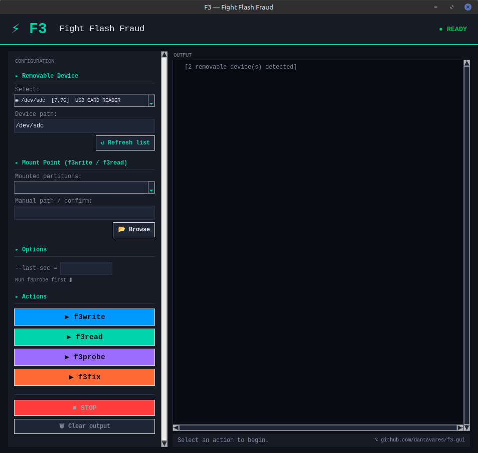

<div align="center">

 <BR>

<P> A modern graphical interface for Fight Flash Fraud </P>

<br> 

</div>

---

## ✨ Features

- **Automatic detection** of removable storage devices (USB drives, SD cards)
- **Smart device ↔ mount point synchronization**
- **Clear final verdict**: ✅ genuine device or ⛔ fake capacity
- **Automatic extraction** of `--last-sec` from f3probe for direct use in f3fix
- **Built-in terminal** with real-time output and color-coded logs
- **Progress bars** for write and read operations
- **Responsive, scrollable UI** — works on any screen size

---

## 🚀 Usage

### 📦 Install using Flatpak

Due to required raw device access (`/dev`), this app is **not accepted on Flathub**. 
For now, install via the file <a href="https://dantavares.github.io/f3-gui/f3-gui.flatpakref"> f3-gui.flatpakref </a>


> **Note:** `f3probe` and `f3fix` require root privileges for direct device access.
> It will ask for the user's password when this action is necessary.

---

## 📋 Recommended workflow

```
1. Plug in the suspicious device
2. Click ↺ Refresh list
3. Select the device
4. Run f3write  → writes test data
5. Run f3read   → verifies integrity (verdict shown automatically)

If the device is fake:
   └─ Run f3probe → detects real capacity (Okay, you can run this one first if you're in a hurry.)
   └─ Run f3fix   → fixes partition table

```

---

## 🔍 Tool overview

| Tool      | Description | Root required |
|-----------|------------|:---:|
| `f3write` | Fills device with test files | No |
| `f3read`  | Verifies written data | No |
| `f3probe` | Detects real capacity without full write | Yes |
| `f3fix`   | Fixes partition table to match real size | Yes |

---

## 📄 License

Licensed under **GPL-3.0**. See [LICENSE](LICENSE).

---

## 🙏 Credits

- f3 by [Michel Machado](https://github.com/AltraMayor)
- GUI built with Python + Tkinter
