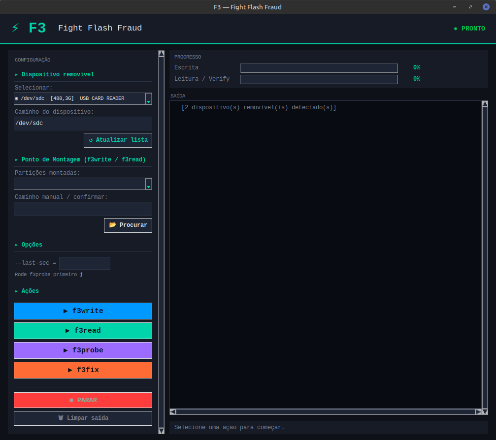

<div align="center">


# F3 GUI

**A modern graphical interface for [Fight Flash Fraud (f3)](https://github.com/AltraMayor/f3)**

Detect and repair USB drives and memory cards that falsely report their actual capacity.

[](LICENSE)
[](https://python.org)
[]()
[]()



</div>

---

## ✨ Features

- **Automatic detection** of removable storage devices (USB drives, SD cards)
- **Smart device ↔ mount point synchronization**
- **Clear final verdict**: ✅ genuine device or ⛔ fake capacity
- **Automatic extraction** of `--last-sec` from f3probe for direct use in f3fix
- **Built-in terminal** with real-time output and color-coded logs
- **Progress bars** for write and read operations
- **Responsive, scrollable UI** — works on any screen size

---

## 🛠️ Requirements

### f3 (Fight Flash Fraud)

```bash
# Debian / Ubuntu / Linux Mint
sudo apt install f3

# Arch Linux
sudo pacman -S f3

# Fedora
sudo dnf install f3
```

### Python 3 + Tkinter

```bash
# Debian / Ubuntu
sudo apt install python3 python3-tk

# Arch Linux
sudo pacman -S python tk

# Fedora
sudo dnf install python3 python3-tkinter
```

---

## 🚀 Usage

```bash
git clone https://github.com/dantavares/f3-gui.git
cd f3-gui
python3 f3_gui.py
```

> **Note:** `f3probe` and `f3fix` require root privileges for direct device access.  
> Run with `sudo` if needed, or configure `polkit` for passwordless execution.

---

## 📋 Recommended workflow

```
1. Plug in the suspicious device
2. Click ↺ Refresh list
3. Select the device
4. Run f3write  → writes test data
5. Run f3read   → verifies integrity (verdict shown automatically)

If the device is fake:
   └─ Run f3probe → detects real capacity
   └─ Run f3fix   → fixes partition table
```

---

## 🔍 Tool overview

| Tool      | Description | Root required |
|-----------|------------|:---:|
| `f3write` | Fills device with test files | No |
| `f3read`  | Verifies written data | No |
| `f3probe` | Detects real capacity without full write | Yes |
| `f3fix`   | Fixes partition table to match real size | Yes |

---

## 📦 Flatpak

Due to required raw device access (`/dev`), this app is **not accepted on Flathub**. 
For now, to use via flatpak, install via the file [f3-gui.flatpakref](https://dantavares.github.io/f3-gui/f3-gui.flatpakref)

---

## 🗂️ Project structure

```
f3-gui/
├── f3_gui.py
├── io.github.dantavares.f3-gui.yml
├── io.github.dantavares.f3-gui.metainfo.xml
├── io.github.dantavares.f3-gui.desktop
├── io.github.dantavares.f3-gui.svg
├── f3-gui-wrapper
├── screenshots/
│   └── main.png
└── README.md
```

---

## 🤝 Contributing

Contributions are welcome.

- Open an issue for bugs or ideas
- Submit pull requests with clear descriptions
- Keep commits clean and focused

---

## 📄 License

Licensed under **GPL-3.0**. See [LICENSE](LICENSE).

---

## 🙏 Credits

- f3 by Michel Machado  
- GUI built with Python + Tkinter
